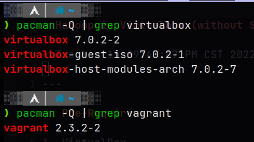
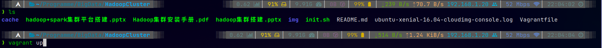
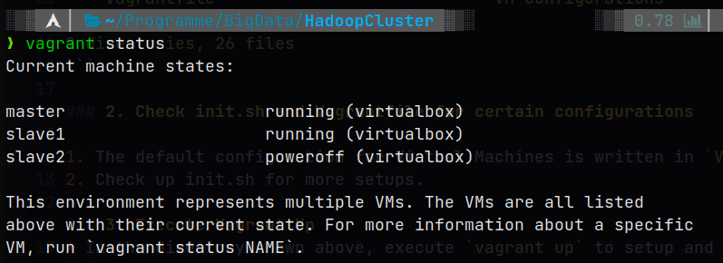
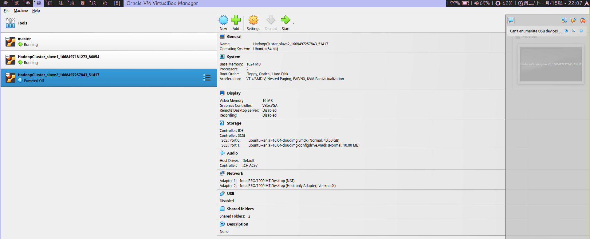
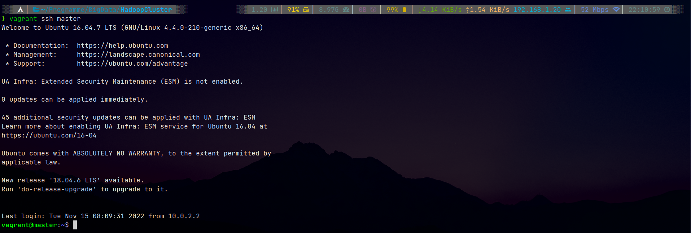
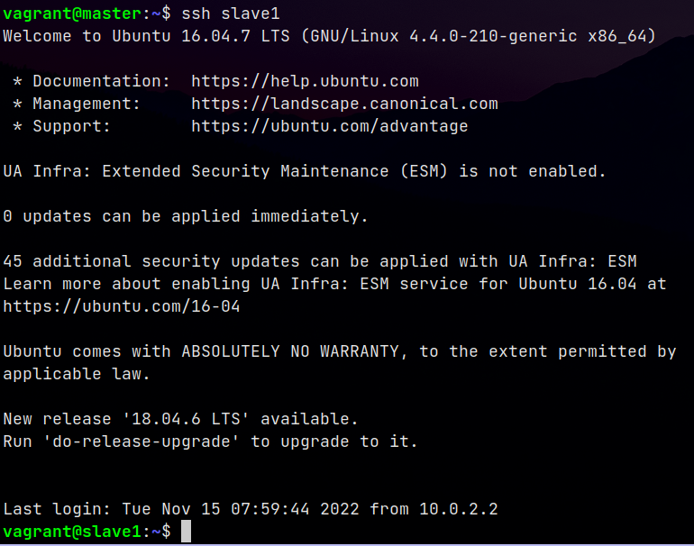
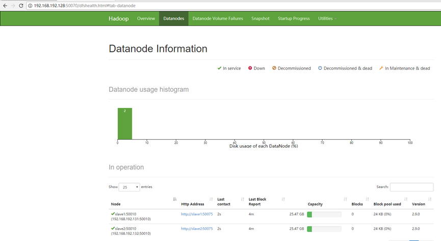
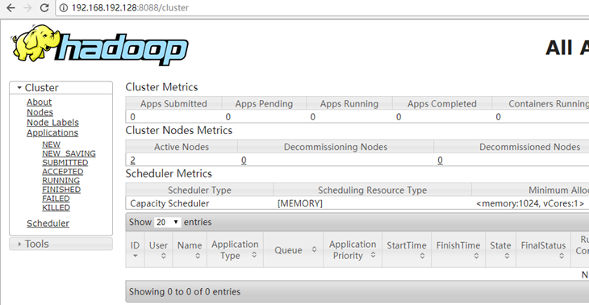

# Hadoop in Virtualbox (without SPARK)

* Tue Nov 15 09:47:47 PM CST 2022

---

## Pre-Requirement

1. VirtualBox
2. vagrant
<center>
    <br>
    <div style="color:orange; border-bottom: 1px solid #d9d9d9;display: inline-block;color: #999;padding: 2px;">virtualbox and vagrant</div>
</center>
3. Access to Internet
    * The base OS we choose to deploy Hadoop Cluster is Ubuntu 16, thus we should be able to fetch "ubuntu/xenial64" from [vagrant cloud](https://app.vagrantup.com/boxes/search).
    * Also, the first step in your vm is to update and install necessary applications such as `ssh`, `rsync` and `vim`.

## Installation

### 1. Ingredients checkup
* Make sure the Directory has the following structure
```
.
├── cache                               -- Files to replace in VM
│   ├── core-site.xml                   -- replace /usr/local/hadoop/etc/hadoop/core-site.xml in VM
│   ├── hadoop-2.9.0.tar.gz             -- hadoop 
│   ├── hdfs-site.xml                   -- replace /usr/local/hadoop/etc/hadoop/hdfs-site.xml in VM 
│   ├── hosts                           -- replace /usr/hosts in VM
│   ├── jdk-8u161-linux-x64.tar.gz      -- jdk package
│   ├── mapred-site.xml                 -- replace /usr/local/hadoop/etc/hadoop/mapred-site.xml
│   ├── scala-2.11.8.tgz                -- scala package
│   ├── sources.list                    -- replace /etc/apt/sources.list -> from https://mirrors.tuna.tsinghua.edu.cn/help/ubuntu/
│   ├── spark-2.3.0-bin-hadoop2.7.tgz   -- spark package
│   └── yarn-site.xml                   -- replace /usr/local/hadoop/etc/hadoop/yarn-site.xml
├── hadoop+spark集群平台搭建.pptx       -- ppt instruction for Hadoop + spark on VMware
├── Hadoop集群安装手册.pdf              -- PDF instruction for Hadoop on VMware based on CentOS
├── hadoop集群搭建.pptx                 -- ppt instruction for Hadoop on VMware based on Ubuntu -- Instruction for this Virtualbox Version
├── img                                 -- IMGs in this readme file
├── init.sh                             -- Scripts to execute when VM first starts
├── README.md                           -- This file
└── Vagrantfile                         -- VM Configurations

2 directories, 26 files
```

### 2. Check init.sh and Vagrantfile for certain configurations

1. The default configuration for Virtual Machines is written in `Vagrantfile`. Modifications can be made by changing the code directly.
2. Check up init.sh for more setups.

### 3. Execute Vagrant Up
* In the directory shown above, execute `vagrant up` to setup and boot your vm.
```shell
vagrant up 
```
<center>
    <br>
    <div style="color:orange; border-bottom: 1px solid #d9d9d9;display: inline-block;color: #999;padding: 2px;">Commands to Execute</div>
</center>

* It should take a while. So have a cup of tea and when everything is settled, check your virutal machine with either `vagrant status` or `virtualbox user interface`

```shell
vagrant status
```
<center>
    <br>
    <div style="color:orange; border-bottom: 1px solid #d9d9d9;display: inline-block;color: #999;padding: 2px;">vagrant status</div>
</center>
<center>
    <br>
    <div style="color:orange; border-bottom: 1px solid #d9d9d9;display: inline-block;color: #999;padding: 2px;">virtualbox user interface</div>
</center>

### 4. ssh configurations

1. use `vagrant ssh master` to enter master virtual machine.
```shell
vagrant ssh master
```
<center>
    <br>
    <div style="color:orange; border-bottom: 1px solid #d9d9d9;display: inline-block;color: #999;padding: 2px;">vagrant ssh master</div>
</center>

2. Append public keys to authorized\_keys by `cat /vagrant/cache/authorized_keys >> ~/.ssh/authorized_keys`
```shell
cat /vagrant/cache/authorized_keys >> ~/.ssh/authorized_keys
```
> Note that all three public keys have been generated and pasted in `/vagrant/cache/authorized_keys` by commands in `init.sh` and `Vagrantfile`.

3. Ssh configuration should be done in both slaves as well.

4. Varify ssh configuration by executing `ssh slave1` in `master` virtual machine. You sohuld log into slave1 without entering password.
<center>
    <br>
    <div style="color:orange; border-bottom: 1px solid #d9d9d9;display: inline-block;color: #999;padding: 2px;">log into slave1 without password after ssh configuration</div>
</center>

## Deploy and Varify Hadoop

### 1. Deploy Hadoop
* run `hadoop namenode -format` in `master` virtual machine to configure node information.
```shell
hadoop namenode -format
```

* run `start-all.sh` to start deployment. Always remember to run `stop-all.sh` before virtual machine shutdown.

### 2. Varification
* run `hadoop jar hadoop-mapreduce-examples-2.9.0.jar pi 5 5` in directory `/usr/local/hadoop/share/hadoop/mapreduce` to varify.
```shell
cd /usr/local/hadoop/share/hadoop/mapreduce
hadoop jar hadoop-mapreduce-examples-2.9.0.jar pi 5 5
```
> A number relatively close to pi is then presented. To be more accurate on the result, try running `pi 10 10000` which takes a longer period.

### 3. User Interface

* Hadoop Environment Configuration on `IP:50070` where IP is the static IP for Master. And on `IP:8088` where IP is the static IP of Master and `8088` can be configured in those `.xml` files.

<center>
    <br>
    <br>
    <div style="color:orange; border-bottom: 1px solid #d9d9d9;display: inline-block;color: #999;padding: 2px;">UI</div>
</center>
